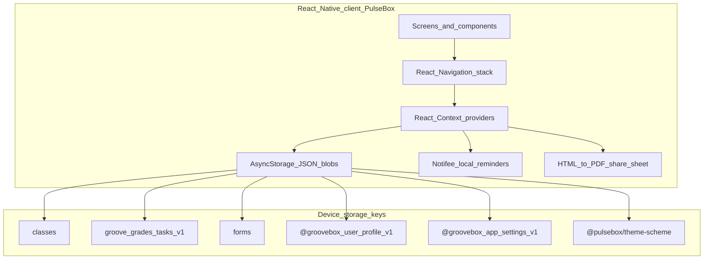

# PulseBox — Architecture and backend specification

This document reflects **what the PulseBox teacher app implements today** (local persistence only) and **what a backend should provide** so the same UX can run against a server without reshaping core concepts.

**Document version:** 1.0 (derived from frontend codebase)

---

## Source of truth in code

| Area | Path |
|------|------|
| Classes, roster, attendance, announcements | `src/context/ClassesContext.tsx` |
| Tasks and gradebook | `src/context/GradesTasksContext.tsx` |
| Forms (quiz builder payloads) | `src/context/FormsContext.tsx` |
| Teacher profile | `src/context/UserContext.tsx` |
| App settings | `src/context/AppSettingsContext.tsx` |
| Navigation / screen surface | `src/types/navigation.ts` |
| Class reminder shape (on class) | `src/types/classReminder.ts` |
| App shell and providers | `App.tsx` |

**Important:** Authentication screens exist, but **there is no production API** today. For example, OTP is explicitly demo-only (`src/authentication/VerifyOtp.tsx`: any 6-digit code). All business data is **JSON in AsyncStorage**.

---

## 1. Current system architecture (logical)



- **Single-teacher, single-device** mental model: no sync, no multi-device merge.
- **Cross-domain links** are **string IDs** (`classId`, `studentId`, `taskId`, `formId`) generated on the client.

---

## 2. AsyncStorage keys (inventory)

| Key | Contents |
|-----|----------|
| `classes` | `ClassData[]` |
| `groove_grades_tasks_v1` | `{ tasks: ClassTask[], grades: TaskGradeRecord[] }` |
| `forms` | `FormData[]` |
| `@groovebox_user_profile_v1` | `UserProfile` JSON |
| `@groovebox_app_settings_v1` | notifications + language |
| `@pulsebox/theme-scheme` | light / dark (client-only for most backends) |

---

## 3. Domain model (canonical schema)

Types mirror the frontend; optional fields match how the UI reads data (missing arrays often treated as empty).

### 3.1 User / teacher profile (`UserProfile`)

| Field | Type | Notes |
|-------|------|--------|
| `displayName` | string | Greeting / header |
| `avatarUri` | string \| null | Today: local `file://` or content URI; backend should return HTTPS URL after upload |
| `email`, `phone`, `country`, `city`, `address` | string | Contact / directory |
| `institutionName`, `professionalTitle`, `subjectsTeach` | string | Profile metadata |

### 3.2 App settings

**Notifications (`NotificationPrefs`):** booleans `taskReminders`, `gradeUpdates`, `classAnnouncements`.

**Language:** `en` \| `es` \| `fr` — only `en` is fully wired in UI copy today (`ready: true` in code).

### 3.3 Class (`ClassData`)

| Field | Type | Notes |
|-------|------|--------|
| `id` | string | Client often uses `Date.now().toString()` |
| `name`, `subject`, `gradeLevel` | string | Required in create flow |
| `studentCount` | number | Denormalized; should match `students.length` when roster exists |
| `schedule` | string | Human-readable combined schedule |
| `roomNumber` | string? | Optional |
| `schoolName` | string? | Optional |
| `schoolType` | string? | One of: `School`, `College`, `University`, `Others` |
| `students` | array? | `ClassStudentRecord[]` |
| `announcements` | array? | `ClassAnnouncement[]` |
| `activityLog` | array? | `ClassActivityItem[]` (newest-first in UI) |
| `attendanceHistory` | array? | `AttendanceDayRecord[]` — one logical row per `dateKey`; **latest save wins** |
| `reminder` | object? | `ClassReminderSettings` (§3.4) |
| `createdAt` | string (ISO) | |

**`ClassStudentRecord`**

| Field | Type | Notes |
|-------|------|--------|
| `id` | string | Stable key for grades and attendance rows |
| `name` | string | |
| `rollNumber` | string? | Teacher-assigned; max 16 characters in UI |
| `email` | string? | |
| `teacherRemark` | string? | **Teacher-private** — do not expose on student-facing APIs |
| `teacherRemarkUpdatedAt` | string (ISO)? | |
| `followUp` | boolean? | At-risk flag (treat as teacher-only unless product says otherwise) |

**`ClassAnnouncement`:** `id`, `body`, `createdAt` (ISO).

**`ClassActivityItem`:** `id`, `kind`, `headline`, `detail?`, `createdAt`.

- `kind`: `announcement` \| `attendance` \| `task_assigned`

**Attendance**

- `AttendanceDayRecord`: `id`, `dateKey` (`YYYY-MM-DD`, device-local calendar meaning), `takenAt` (ISO), `entries[]`.
- `AttendanceDayEntry`: `studentId`, `status` where `status` is `present` \| `absent` \| `late`.

### 3.4 Class reminder (`ClassReminderSettings`)

| Field | Type | Notes |
|-------|------|--------|
| `enabled` | boolean | |
| `hour`, `minute` | number | Local wall clock |
| `weekdays` | number[] | ISO weekday: 1 = Monday … 7 = Sunday |

Implemented with **Notifee** on device. Backend may store the same payload for sync or push.

### 3.5 Gradebook: `ClassTask` and `TaskGradeRecord`

**`ClassTask`**

| Field | Type | Notes |
|-------|------|--------|
| `id` | string | From forms: **deterministic** `form-{formId}-cls-{classId}` |
| `classId` | string | |
| `title` | string | |
| `kind` | string | `quiz` \| `assignment` \| `project` \| `test` |
| `dueLabel` | string? | Short label |
| `dueAt` | string (ISO)? | Deadline end |
| `createdAt` | string (ISO) | |
| `formId` | string? | Set when task comes from form builder |

**`TaskGradeRecord`**

| Field | Type | Notes |
|-------|------|--------|
| `id` | string | Client pattern on assign: `g-{taskId}-{studentId}` |
| `classId`, `taskId`, `studentId` | string | Composite logical identity |
| `grade` | string | Free text (`92%`, `A−`, `—`, …) |
| `status` | string | `graded` \| `pending` \| `missing` |

**Assign payload (frontend contract)** — mirror as API body if exposing `assignFormToClasses`:

```typescript
type AssignFormToClassesPayload = {
  formId: string;
  title: string;
  kind: 'quiz' | 'assignment' | 'project' | 'test';
  dueLabel?: string;
  dueAt?: string; // ISO
  targets: { classId: string; studentIds: string[] }[];
};
```

**Behavior today**

- `assignFormToClasses`: upserts one task per `(formId, classId)` and ensures a grade row per listed `studentId` (default `grade: "—"`, `status: "pending"`).
- `removeTasksForForm(formId)`: deletes tasks with that `formId` and all grades whose `taskId` referenced those tasks.

### 3.6 Forms (`FormData`)

| Field | Type | Notes |
|-------|------|--------|
| `id` | string | |
| `name` | string | |
| `iconId` | string | |
| `answers` | JSON | **Opaque** — full builder payload; version in API if schema evolves |
| `createdAt` | string (ISO) | |

---

## 4. Entity relationships and integrity (backend)

- `ClassTask.classId` must reference a class owned by the authenticated user.
- `TaskGradeRecord`: tuple `(classId, taskId, studentId)` must be **unique**.
- `studentId` on a grade should exist on that class roster.
- `taskId` on a grade must reference a task with the same `classId`.
- Form-linked tasks: today `task.id === "form-{formId}-cls-{classId}"` and `task.formId === formId`. Server may keep this or issue internal IDs **only if** the mobile app is updated everywhere (navigation, reports, grade screens).
- Attendance: each `entries[].studentId` should belong to the class roster (frontend does not strictly validate).
- `studentCount` should stay consistent with `students.length`.

---

## 5. Frontend-imposed requirements for the backend

1. **Multi-tenancy:** Scope classes, forms, tasks, and grades to an **authenticated teacher** (or org + user if you add institutions).
2. **IDs:** Prefer **server UUIDs** for new entities; if accepting client IDs, treat as opaque strings and echo back on create to simplify migration.
3. **Timestamps:** **ISO 8601** for `createdAt`, `takenAt`, `teacherRemarkUpdatedAt`, `dueAt`, etc.
4. **`dateKey`:** Document timezone semantics (device-local `YYYY-MM-DD` vs UTC) when syncing attendance.
5. **Privacy:** `teacherRemark` and likely `followUp` are **teacher-only**; separate ACL from student/parent APIs.
6. **`grade`:** Treat as **display string** unless you add a normalized numeric score field later.
7. **Forms `answers`:** Store as **JSON document**; recommend `schemaVersion` if you evolve the builder.
8. **Conflicts:** Today **last write wins** per attendance `dateKey`. Match that or add `updatedAt` + explicit merge rules.
9. **Auth:** Real **email verification**, **password reset**, **sessions** (e.g. JWT + refresh) aligned with `Login`, `SignUp`, `ForgotPassword`, `VerifyOtp`.
10. **Avatar:** **Multipart upload** → HTTPS URL in profile.
11. **Notifications:** Settings toggles exist on device; class reminders are **local** today — decide FCM/APNs vs storage-only.

---

## 6. Suggested API surface (sketch)

Not implemented in the app; illustrative contract for REST or GraphQL.

| Area | Operations |
|------|------------|
| Auth | Register, login, refresh, forgot-password, verify OTP/email, logout |
| Profile | GET/PATCH profile; POST avatar |
| Settings | GET/PATCH notification prefs and language |
| Classes | CRUD class; roster patch; announcements; activity log append; attendance upsert by `dateKey`; reminder patch |
| Forms | CRUD form documents |
| Gradebook | List tasks/grades by `classId`; PATCH grade row; POST assign-form (payload as §3.5); cascade delete when form deleted |
| Sync (optional) | `GET /sync?since=cursor` for offline-first clients |

---

## 7. Use cases (teacher-facing)

| ID | Goal | Primary data |
|----|------|----------------|
| UC-01 | Create class with schedule, school, roster | `ClassData` |
| UC-02 | View classes and class details | `ClassData`, `activityLog`, `announcements` |
| UC-03 | Manage roster (add one, CSV import, bulk delete) | `students`, `studentCount` |
| UC-04 | Bulk assign roll numbers (“Assign everyone”) | `students[].rollNumber` |
| UC-05 | Edit one student: roll, remark, follow-up | `ClassStudentRecord` |
| UC-06 | Mark attendance for a day | `attendanceHistory` |
| UC-07 | Post announcement | `announcements`, `activityLog` |
| UC-08 | Configure weekly class reminder | `reminder`, Notifee |
| UC-09 | Build/edit forms | `FormData.answers` |
| UC-10 | Publish form to class(es) | `assignFormToClasses` → tasks + grades |
| UC-11 | View/edit grades | `TaskGradeRecord` |
| UC-12 | Task-level grade report | tasks + grades for `classId` + `taskId` |
| UC-13 | Export PDFs (grades, attendance, student record) | **Client-generated**; server optional |
| UC-14 | Profile and app settings | `UserProfile`, app settings |

**Student/parent apps** are not in this repo; shared links for forms imply a **separate** web or mobile surface and API.

---

## 8. Client-only features (no backend required today)

- PDF export via `react-native-html-to-pdf` and system share.
- Notifee-triggered class reminders.
- Theme preference (`@pulsebox/theme-scheme`).
- Share/deep links for forms — backend may provide short URLs resolving to `formId`.

---

## 9. Migration: AsyncStorage → API

1. After first successful login, **upload or merge** blobs: `classes`, `groove_grades_tasks_v1`, `forms`, profile, settings.
2. If the server **reissues IDs**, return a **mapping** or require a single client migration pass rewriting all foreign keys.
3. Either **preserve** `form-{formId}-cls-{classId}` task IDs or update `assignFormToClasses` and every consumer (`TaskGradeReport`, `ViewGrades`, etc.) together.

---

## 10. Follow-ups for backend and mobile teams

- Review domain model and **form task ID** convention.
- Replace demo OTP with production auth.
- Draft OpenAPI from §6 and choose sync strategy.
- Define ACL for `teacherRemark` / `followUp` vs any future student API.
